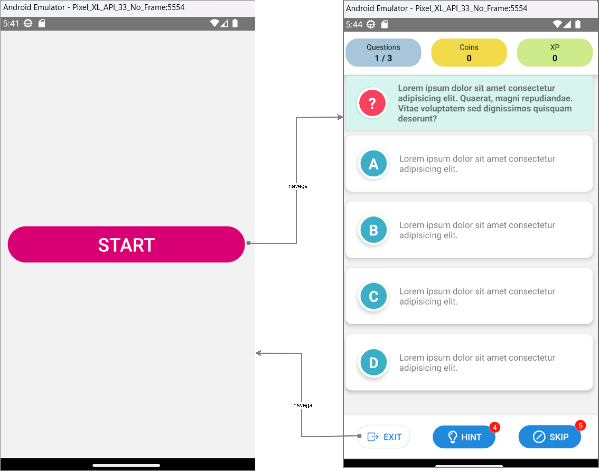
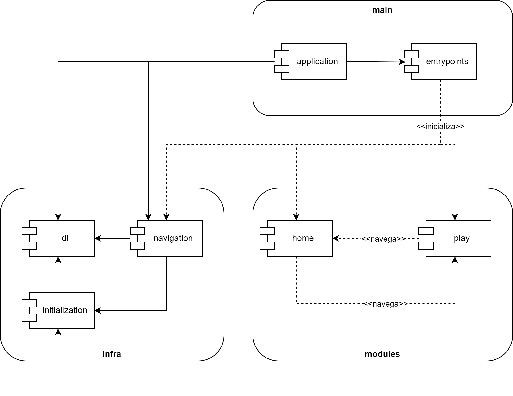
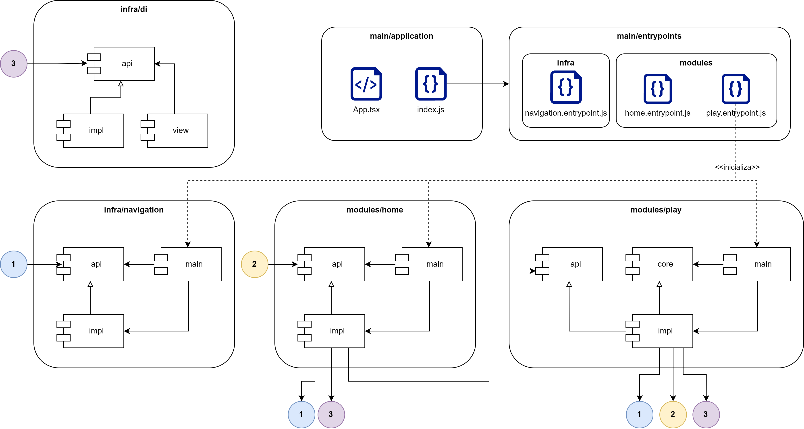
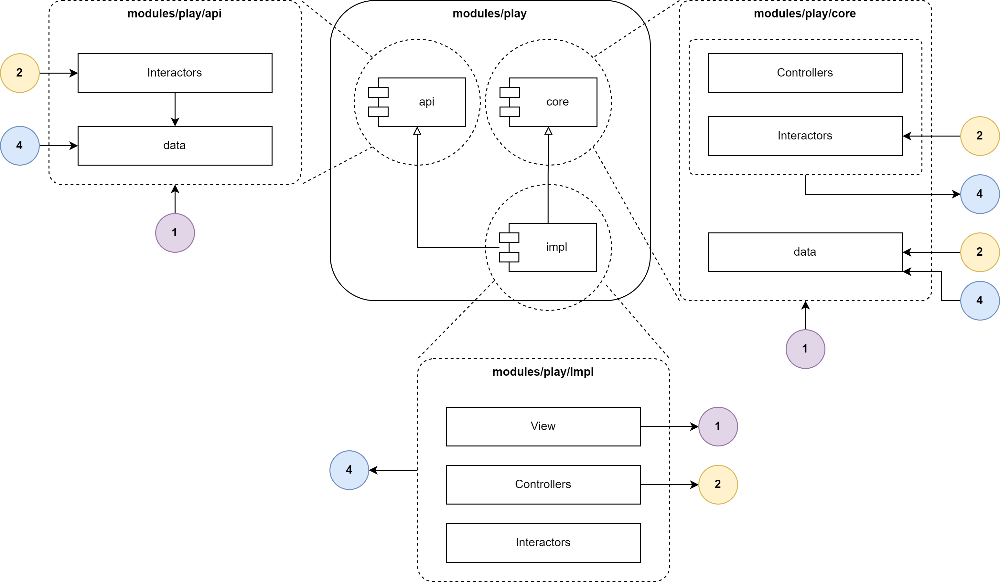

= Documentação
:author: Alessandro Balotta de Oliveira
:doctype: book
:source-highlighter: rouge
:rouge-style: monokai
:icons: font
:icon-set: fas
:toc: macro
:toc-title: Sumário
:pagenums:
:figure-caption: Figura
:sectnums:
:sectnumlevels: 1
:nofooter:
:!chapter-signifier:
:chapter-label:
:blank: pass:[ +]

toc::[]

== Introdução

Este projeto, cujo objetivo é demonstrar a solução de injeção de dependência criada para a disciplina de Arquitetura e Design de Software, contém o código-fonte de um jogo de quiz simples desenvolvido em `React Native` com `Typescript`.

=== O jogo

Consiste de duas telas, a saber: `HomeScreen`, que apresente o botão de início do jogo, e `PlaySessionScreen`, que apresenta a sessão do jogo, onde as perguntas são exibidas, uma por vez. A Figura 1 apresenta essas telas e a relação de navegação entre elas.

{blank}

.Telas do jogo e navegação entre elas.

{blank}

* O objetivo do jogo é sobreviver e colecionar o maior número de moedas e pontos XP possível.
* Cada resposta certa vale 05 moedas e 01 ponto XP.
* O jogo permite pular até cinco vezes por sessão (botão `Skip`). É possível pular até 05 vezes por sessão e não é possível pular a última pergunta da sessão.
* O jogo permite solicitar dicas (botão `Hints`), que revelam até 02 respostas erradas por pergunta. É possível pedir até 04 dicas por sessão.
* A sessão termina quando a última pergunta é respondida ou quando uma resposta errada é selecionada.

== Arquitetura

O código está organizado de acordo com a Figura 2.

{blank} 

.Macroarquitetura

{blank}

src/main:: Módulo principal, contém os submódulos `application` e `entrypoints`.
src/main/application:: Contém o componente `App.tsx`, ponto de entrada para o React Native, e o arquivo `index.js` responsável por chamar os inicializadores definidos em `src/main/entrypoints`. 
+
O arquivo `index.js` chamará primeiro os inicializadores definidos em `src/main/entrypoints/infra` e, em seguida, os definidos em `src/main/entrypoints/modules`, garantindo, dessa forma, que as classes de `src/infra` já estarão disponíveis na injeção de dependência quando os submódulos em `src/modules/*` forem inicializados.
src/main/entrypoints:: Contém arquivos inicializadores. Cada arquivo expõe uma `default function` que, por sua vez, é responsável por chamar a `default function` exposta pela camada `main` do submódulo a que o respectivo arquivo se destina. 
+
Por exemplo, `src/main/entrypoint/infra/navigation.entrypoint.js` deve chamar a função exposta em `src/infra/navigation/main`. O objetivo dessas inicializações é principalmente invocar o mapeamento da injeção de dependência. 
+
O fato de haver um arquivo por submódulo, em vez de apenas um arquivo para todos submódulos, tem como objetivo isolar essas implementações, impedindo que mais de uma equipe (no contexto em que há uma equipe por submódulo) altere o mesmo arquivo e, assim, evitando possíveis conflitos no controle de versionamento.
src/infra:: Contém submódulos de suporte genéricos, ou seja, não específicos do negócio.
src/infra/di:: Contém a solução para a injeção de dependência. Essa solução foi desenvolvida para o presente projeto e, portanto, não se apoia em bibliotecas de terceiros.
src/infra/navigation:: Contém a solução para o grafo de telas e de navegação. Esse submódulo cria `Adapters` para a biblioteca `React Native Navigation`, que é oferecida pela comunidade.
src/modules:: Contém os submódulos específicos do negócio.
src/modules/home:: Contém a implementação da tela inicial do jogo.
src/modules/play:: Contém a implementação da sessão do jogo.

A Figura 3 apresenta a organização interna de cada submódulo.

{blank}

.Arquitetura dos submódulos

{blank}

Os submódulos de `infra` e `modules` possuem a mesma estrutura básica, a saber:

/api:: Opcional. Expõe as abstrações de fronteira que medeiam a comunicação entre submódulos. 
+
Por exemplo, `modules/home/api` expõe a interface `HomeNavigation` que permite que `modules/play/impl` possa navegar de volta para a tela inicial do jogo. Devem ser expostas em `/api` apenas as abstrações que precisem ser conhecidas por outros submódulos juntamente com as estruturas de dados que tais abstrações utilizam em seus métodos. 
+
Internamente, os pacotes `/api` dos submódulos pertencentes ao módulo de negócio (`src/modules`) organizam o código em camadas com base na `Clean Architecture`. 
/core:: Opcional. Expõe as abstrações de fronteira que medeiam a comunicação entre as camadas internas do submódulo. Dessa forma, são abstrações que não devem ser conhecidas por classes de outros submódulos. 
+
A separação dessas abstrações em um pacote específico se dá por causa das limitações do `Typescript`, que não transpila metadados sobre as interfaces (interfaces existem apenas em tempo de transpilação), o que dificulta a criação de testes unitários arquiteturais. Com essa separação, é possível criar testes arquiteturais baseados em pacote. 
+
Internamente, os pacotes `/core` dos submódulos pertencentes ao módulo de negócio (`src/modules`) organizam o código em camadas com base na `Clean Architecture`. 
/impl:: Mandatório. Contém as classes concretas do submódulo, inclusive as que implementam as abstrações definidas em `/api` e `/core`. 
+
Internamente, os pacotes `/impl` dos submódulos pertencentes ao módulo de negócio (`src/modules`) organizam o código em camadas com base na `Clean Architecture`. 
/main:: Mandatório se o respectivo submódulo for inicializável (ou seja, se contiver um inicializador em `src/main/entrypoints`). Contém arquivos do tipo `provider` ou `navigation`. Arquivos `provider` consistem em uma `default function` que mapeiam na injeção de dependência uma determinada classe. 
+
Por exemplo, `src/modules/play/main/HintStrategy.provider.ts` mapeia, na injeção de dependência, a classe concreta que implenta a abstração `HintStrategy`. Arquivos `navigation`, por sua vez, mapeiam telas e respectivas rotas no grafo de navegação. Para isso, obtém da injeção de dependência a classe concreta da abstração `src/infra/navigation/api/mapper/NavigationMapper`. Dessa forma, o submódulo não depende diretamente da concretude. 
+
O fato de haver um arquivo por `provider` / `navigation`, em vez de apenas um arquivo para todos os mapeamentos, tem como objetivo melhorar o isolamento dessas implementações, evitando possíveis conflitos no controle de versionamento. 
+
Assim, o que os inicializadores fazem é importar todos os arquivos presentes nos respectivos pacotes `main` e chamar a `default function` exposta em cada arquivo. No `React Native`, no entanto, não é possível realizar um `dynamic import` sem passar, via literal, o nome do arquivo a ser importado, pois os `import` devem ser conhecidos em tempo de compilação. Para contornar esse problema, o presente projeto conta com a biblioteca `babel-plugin-wildcard`.

A Figura 4 apresenta a organização interna dos pacotes `src/modules/\*/api`, `src/modules/*/core` e `src/modules/*/impl`, baseada no `Clean Architecture`.

{blank}

.Clean Architecture na organização interna dos submódulos.

{blank}

As seguintes regras arquiteturais são estabelecidas:

* Camadas de `/impl` devem estar isoladas uma das outras. A comunicação entre elas deve ser mediada pelas abstrações presentes em `/api` ou `/core`.
* Classes de `/api` não podem depender de concretudes presentes em `/core` ou `/impl`.
* Classes de `/core` não podem depender das de `/impl`, mas podem depender de `/api`.
* A camada `View`, que contém componentes de tela, pode depender de todas as demais, mas nenhuma outra pode depender dela.
* A camada `Controllers`, que contém os métodos para as interações de usuário, podem depender de `Interactors` ou `Data`, mas não pode depender de `View`.
* A camada `Interactors`, que contém os casos de uso (implementados como `Strategy` ou `Repository`), pode depender de `Data`, mas não de `Controllers` ou `View`.
* A camada `Data`, que contém estruturas de dados, pode ter como dependentes todas as demais, mas não pode depender de nenhuma das outras camadas. 
+
Estruturas de dados que não devem ser visíveis por todas as camadas podem existir em camadas específicas. Por exemplo, estruturas de dados que representam estados de tela podem existir na camada `Controllers` para que sejam visíveis pelas classes dessa camada e pelas da camada `View` apenas.

[NOTE]
Essas regras são verificadas por testes arquiteturais presentes em `test/architecture`. Para a escrita desses testes arquiteturais, o presente trabalho utilzia a biblioteca `ts-arch` junto com a suíte de testes `jest`.

== Injeção de Dependência

A solução de injeção de dependência implementa, para `/impl/view`, um `Service Locator`. Para as as demais camadas de `/impl`, se dá pelo construtor das classes. A razão dessa diferença é que a instanciação e gerenciamento das classes/funções de tela presentes em `impl/view` é feita pelo `React Native`.

O mapeamento da injeção de dependência se dá nos arquivos `Providers` presentes nos respectivos `/main` de cada submódulo. Cada submódulo pode mapear apenas as classes que lhe pertencem. A Figura 5 exemplifica esse mapeamento.

{blank}

.Figura 5. Arquivo src/modules/play/main/HintStrategy.provider.ts
[,typescript]
----
include::../src/modules/play/main/HintStrategy.provider.ts[tag=docs]
----
<1> Início da definição da função `factory` que será mapeada na injeção.
<2> Obtém da própria injeção de dependência a classe concreta que responde pela interface `QuestionRepository`, de que `HintStrategyImpl` depende.
<3> Instancia e retorna a classe `HintStrategyImpl`.
<4> Mapeia a função `factory` na injeção de dependência.

{blank}

Mapeia-se na injeção uma função `factory` responsável por criar a classe desejada quando o método `inject` da injeção for chamado. Trata-se, portanto, de uma abordagem `lazy`. 

Essa função `factory` é relacionanda a um `token`, ou seja, uma `string`, que deverá ser passada por parâmetro ao método `inject`. Como o `Typescript` não transpila as informações das interfaces (e, portanto, não existe interface após a transpilação), não é possível associar diretamente a função `factory` com a interface a que se destina. Por convenção, o `token` deve ser o nome dessa interface.

É possível usar dois métodos para realizar o mapeamento, ambos definidos na interface `DIMapper`, a saber: 

* `single`, que cria um `wrapper` para a função `factory` e, por meio dele, garante que o objeto criado por essa função será um `Singleton` durante a execução do programa.
* `factory`, que garante que a função `factory` mapeada será chamada a cada vez que o método `inject` for executado, o que resulta, portanto, na criação de objetos distintos a cada injeção.

=== Service Locator 

Para os componentes da camada `View`, foram criados um `React Context` em `src/infra/di/view/DIContext`, que expõe o _container_ da injeção de dependência para a árvore de componentes de tela do `React Native` (cuja raiz é o arquivo `App.tsx`), bem como os _hooks_ `useDI`, que acessa o _container_ exposto pelo `DIContext`, e o _useInject_, que decora o `useDI` com o _hook_ `useRef` do _framework_ para melhorar o desempenho. Ambos os _hooks_, `useDI` e `useInject` estão definidos em `src/infra/di/view/Hooks`. 

A Figura 6 mostra um exemplo do uso do _hook_ `useInject` para obter uma independência do _container_ de injeção.

{blank}

.Figura 6. Arquivo src/modules/home/impl/view/screens/HomeScreen.tsx
[,tsx]
----
include::../src/modules/home/impl/view/screens/HomeScreen.tsx[tag=docs]
----
<1> Chamada ao _hook_ `useInject` para obter a classe concreta da abstração `PlayNavigation` definida em `src/modules/play/api`

{blank}

== Testes

Os testes unitários para a injeção de dependência podem ser encontrados em `test/infra/di/impl` e, para as regras arquiteturais, em `test/architecture`. Esses testes unitários utilizam a suíte de testes `jest` e seguem uma organização hierárquica definida pelas chamadas ao método `describe` do `jest`.

A anatomia desses testes segue o padrão _GIVEN_ - _WHEN_ - _THEN_. Na parte _GIVEN_, é feita a preparação dos testes com _mocks_. Em _WHEN_, o método a ser testado é executado, e, em _THEN_, as verificações pertinentes são feitas.

Para executar os testes, basta disparar o comando `yarn run jest test/` a partir da raiz do projeto.

[NOTE]
É necessário rodar o comando `yarn` a partir da raiz do projeto antes de rodar os testes ou o projeto pela primeira vez. Esse comando baixará as bibliotecas necessárias. 

Para o _container_ de injeção de dependência, criou-se a classe `DIProxy` especificamente para ser usada no contexto dos testes unitários. O objetivo dessa classe, que herda do _container_, é expor para os testes o `Map` em que o mapeamento da injeção é mantido (esse `Map` é privado na classe pai), bem como impedir que um teste interfira no outro (dado que o _container_ é um `Singleton`). Com isso, evita-se expor o `Map` na classe pai e mantém-se a atomicidade dos testes.

== Execução do Projeto 

Para executar o projeto em um emulador `Android`, os seguintes passos são necessários:

* Instalar o NodeJS
* Instalar JDK
* Instalar o Android Studio
* Instalar o Android SDK (via Android Studio)
* Criar a imagem do emulador (via Android Studio)
* Configurar a variável de ambiente `ANDROID_HOME` com o caminho para o Android SDK
* Adicionar o caminho para `/platform-tools` na variável de ambiente `PATH`
* Em um CLI, executar, a partir da raiz do projeto, o comando `yarn`
* Em um CLI, executar, a partir da raiz do projeto, o comando `yarn start` e selecionar a opção "android" quando o menu aparecer no CLI.

Instruções detalhadas podem ser encontradas em https://reactnative.dev/docs/environment-setup (opção React Native CLI Quickstart)

[NOTE]
Recomenda-se o uso da _IDE_ VS Code.
